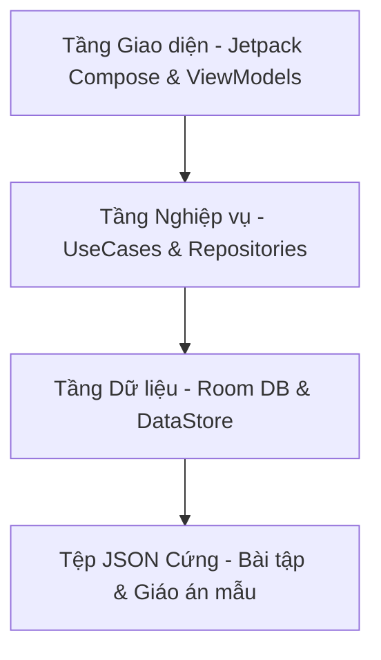

# 🏋️‍♂️ SmartGym — Trợ lý Luyện tập Offline Toàn diện

<p align="center">
  
  
  
  
</p>

---

## 🎯 Định hướng Sản phẩm (Product Scope)

**SmartGym** là ứng dụng di động hỗ trợ luyện tập thể hình cá nhân dành cho hệ điều hành Android, được thiết kế theo triết lý **Offline-First**. Ứng dụng hoạt động hoàn toàn ngoại tuyến nhằm tối ưu hóa sự tập trung của người dùng trong phòng tập, không yêu cầu tài khoản, không đồng bộ đám mây và không chứa quảng cáo.

> [!NOTE]
> Ứng dụng được thiết kế như một công cụ lập kế hoạch luyện tập tổng quát. SmartGym **không đưa ra lời khuyên y tế** hoặc các phác đồ điều trị chấn thương.

---

## 🎨 Ngôn ngữ Thiết kế (Visual Identity & UI Specs)

Tuân thủ nghiêm ngặt các quy tắc giao diện đặc trưng được quy định trong thỏa thuận phát triển:

* **Màu sắc chủ đạo**:
  * Nền chính: Trắng tinh khiết (`#FFFFFF`) — Mang lại sự sạch sẽ, tối giản.
  * Văn bản chính: Xanh biển đậm (`#14213D`) — Tạo độ tương phản cao, dễ đọc dưới ánh sáng phòng tập.
  * Hành động & Điểm nhấn: Cam sáng (`#F97316`) — Kích thích năng lượng và sự tập trung.
  * Hoàn thành & Tiến độ: Xanh lá (`#22C55E`) — Biểu thị trạng thái thành công.
  * Bề mặt hỗ trợ: Xám nhạt (`#F3F4F6`) — Dùng cho thẻ, đường viền và phân vùng.
* **Phong cách phẳng (Flat UI)**:
  * Tuyệt đối không sử dụng hiệu ứng chuyển màu (gradients).
  * Viền mỏng, đổ bóng nhẹ và góc bo vừa phải tạo cảm giác hiện đại, gọn gàng.
  * Thiết kế phím bấm kích thước lớn (tối thiểu `48x48dp`), bố trí tối ưu cho thao tác bằng một tay.

---

## 🚀 Tính năng Cốt lõi (Core Features)

Ứng dụng được tổ chức xung quanh 3 điểm đến điều hướng chính:

### 1. Hôm nay (Today Screen)
* Hiển thị danh sách bài tập được chỉ định cho ngày hiện tại dựa trên chương trình tập luyện đã chọn.
* Tích chọn hoàn thành từng hiệp tập trực quan với bộ đếm ngược thời gian nghỉ ngơi (Rest Timer).
* Buổi tập chỉ được tính là hoàn thành khi tất cả các bài tập trong ngày được đánh dấu tích chọn.

### 2. Tiến độ (Progress Screen)
* **Biểu đồ đóng góp (Contribution Graph)**: Hiển thị tần suất luyện tập trong 18 tuần gần nhất dạng ô lưới trực quan (tương tự GitHub).
* **Lịch sử tập luyện**: Xem lại danh sách các buổi tập đã hoàn thành trong quá khứ dưới dạng lịch tháng.
* **Dự báo hoàn thành**: Ước tính thời gian hoàn thành mục tiêu dựa trên tốc độ và tần suất tập luyện thực tế của người dùng.

### 3. Cài đặt & Thích nghi (Settings & Adaptation)
* Thay thế hoặc điều chỉnh mục tiêu luyện tập hiện tại mà vẫn bảo toàn lịch sử tập luyện đã thực hiện.
* **Đề xuất thích nghi tự động (Automatic Adaptation)**: Đưa ra đề xuất điều chỉnh chế độ dinh dưỡng và cường độ tập luyện dựa trên phản hồi mức độ mệt mỏi sau mỗi buổi tập.
* Hỗ trợ giải thích đề xuất thích nghi bằng tiếng Việt (yêu cầu sự đồng ý của người dùng và kết nối mạng nếu sử dụng AI giải thích).

---

## 🏗️ Kiến trúc & Công nghệ (Tech Stack & Architecture)

Dự án được xây dựng dựa trên mô hình kiến trúc sạch (**Clean Architecture**), chia tách trách nhiệm rõ ràng giữa các tầng dữ liệu và giao diện người dùng:



* **Room Database**: Lưu trữ dữ liệu về mục tiêu, các buổi tập được tạo ra, lịch sử hoàn thành hiệp tập một cách nguyên tử (atomic transactions).
* **DataStore**: Lưu trữ các tùy chọn cấu hình nhỏ như thời gian nhắc nhở và thiết lập ngày nghỉ.
* **Bundled Assets**: Chứa dữ liệu tĩnh về bộ bài tập mẫu tiếng Việt (Free Exercise DB) và danh mục giáo án mẫu chuẩn hóa.
* **Coroutines & Flow**: Quản lý các luồng dữ liệu bất đồng bộ và đồng bộ hóa trạng thái giao diện UI phản ứng (Reactive UI).

---

## 🔧 Cài đặt & Kiểm thử (Setup & Testing)

Dự án sử dụng công cụ xây dựng Gradle tiêu chuẩn. Các lệnh CMD hữu ích trên môi trường Windows:

### Biên dịch ứng dụng
```powershell
# Biên dịch phiên bản chạy thử
.\gradlew.bat assembleDebug

# Biên dịch cả ứng dụng chính và bộ test Android tích hợp
.\gradlew.bat assembleDebug assembleDebugAndroidTest
```

### Chạy kiểm thử tự động
```powershell
# Chạy toàn bộ Unit Tests cục bộ (Logic thích nghi, Chọn giáo án, Lọc lịch,...)
.\gradlew.bat test

# Chạy kiểm thử giao diện và tích hợp trên thiết bị/trình giả lập (Instrumented Tests)
.\gradlew.bat connectedAndroidTest
```

---

## Phân tích ảnh món ăn và nhãn dinh dưỡng (Thử nghiệm)

Ứng dụng Flutter có luồng `Chụp món ăn` để nhận diện món thường tại quán hoặc đọc nhãn dinh dưỡng. Kết quả AI chỉ là quan sát ban đầu: người dùng luôn phải xác nhận món, khẩu phần hoặc trường trên nhãn trước khi backend tính toán bằng dữ liệu đã duyệt. Không có bước tự động lưu; nhập thủ công vẫn là fallback khi không đồng ý gửi ảnh, ảnh không rõ, dịch vụ lỗi hoặc dữ liệu món chưa được hỗ trợ.

Giá trị được hiển thị dưới dạng khoảng `min / mid / max` vì khẩu phần gia dụng, dầu, sốt và phần món bị che không thể suy ra chính xác từ một ảnh. Tổng dinh dưỡng đã lưu dùng midpoint nhưng vẫn giữ audit metadata và khoảng gốc.

### Backend và endpoint

```powershell
cd server
npm ci
Copy-Item .env.example .env  # hoặc tự tạo server/.env cục bộ
# đặt GEMINI_API_KEY; GEMINI_MODEL là tùy chọn
npm start
```

`server/.env` không được commit. Các endpoint ảnh mới:

| Endpoint | Mục đích |
|---|---|
| `GET /api/food-analyses/foods` | Danh mục món và capability khẩu phần công khai |
| `POST /api/food-analyses` | Gửi multipart `primaryImage`, tạo phiên review |
| `POST /api/food-analyses/:analysisId/images` | Gửi multipart `secondaryImage` khi được yêu cầu |
| `POST /api/food-analyses/:analysisId/confirmations` | Gửi xác nhận typed và nhận khoảng dinh dưỡng deterministic |

Backend xử lý ảnh trong memory, xóa buffer sau request và chỉ giữ observation của phiên tối đa 15 phút. Tuy vậy ảnh vẫn được gửi từ backend tới AI provider. Trước lần gửi đầu tiên, sản phẩm phải có **consent riêng, rõ ràng cho ảnh món ăn**, nêu việc upload tới backend/provider và retention/chính sách hiện hành của provider. Consent `cloudAiConsent` chung cho dữ liệu chỉ số không đủ để đại diện cho việc gửi ảnh; nếu chưa có consent riêng thì phải chặn camera và đưa người dùng sang nhập thủ công/cài đặt phù hợp.

Không mô tả provider là “không lưu ảnh” nếu deployment chưa kiểm chứng đúng policy/retention của model và tài khoản đang dùng. Khi provider hoặc chính sách thay đổi, disclosure phải được cập nhật trước khi bật luồng ảnh.

### Gate độ chính xác riêng tư

Hướng dẫn manifest, provenance/license, target và lệnh chạy nằm tại [`server/evaluation/README.md`](server/evaluation/README.md). Ảnh đánh giá, manifest thật và báo cáo đều bị loại khỏi Git. Tính năng giữ badge **“Thử nghiệm”** (`foodPhotoAnalysisStable = false`) nếu chưa có tập được cấp quyền gồm tối thiểu 30 món + 20 nhãn, hoặc chưa có báo cáo theo ngày đạt toàn bộ accuracy gate và Flutter gate `automatic saves = 0`.

Các route cũ như `POST /api/analyze-food`, `GET /api/scan-barcode` và `POST /api/register-barcode` chỉ còn để tương thích tạm thời với build cũ; chúng không phải entry point chính của UI mới và chưa được xóa trong đợt migration này.
