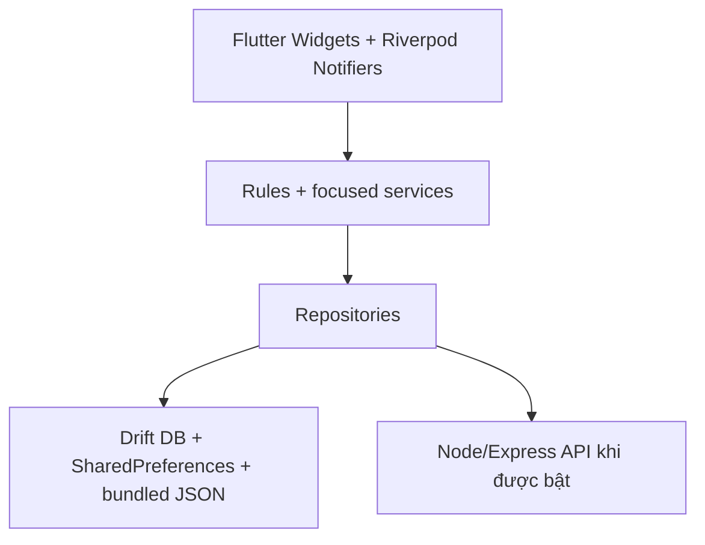

# 🏋️‍♂️ SmartGym — Trợ lý luyện tập offline-first

<p align="center">
  
  
  
  
</p>

---

## 🎯 Định hướng Sản phẩm (Product Scope)

**SmartGym** là ứng dụng Android một người dùng, được thiết kế theo triết lý **offline-first**. Lập kế hoạch, buổi tập, lịch sử và quy tắc cá nhân hóa cốt lõi hoạt động cục bộ; các tính năng như tra cứu dinh dưỡng hoặc AI chỉ dùng mạng khi người dùng chủ động và đã đồng ý. Ứng dụng không yêu cầu tài khoản, không đồng bộ đám mây và không chứa quảng cáo.

> [!NOTE]
> Ứng dụng được thiết kế như một công cụ lập kế hoạch luyện tập tổng quát. SmartGym **không đưa ra lời khuyên y tế** hoặc các phác đồ điều trị chấn thương.

---

## 🎨 Ngôn ngữ Thiết kế (Visual Identity & UI Specs)

Tuân thủ nghiêm ngặt các quy tắc giao diện đặc trưng được quy định trong thỏa thuận phát triển:

* **Màu sắc chủ đạo**:
  * Nền chính: Trắng tinh khiết (`#FFFFFF`) — Mang lại sự sạch sẽ, tối giản.
  * Văn bản chính: Xanh biển đậm (`#14213D`) — Tạo độ tương phản cao, dễ đọc dưới ánh sáng phòng tập.
  * Hành động & Điểm nhấn: Cam sáng (`#F97316`) — Kích thích năng lượng và sự tập trung.
  * Hoàn thành & Tiến độ: Xanh lá (`#22C55E`) — Biểu thị trạng thái thành công.
  * Bề mặt hỗ trợ: Xám nhạt (`#F3F4F6`) — Dùng cho thẻ, đường viền và phân vùng.
* **Phong cách phẳng (Flat UI)**:
  * Tuyệt đối không sử dụng hiệu ứng chuyển màu (gradients).
  * Viền mỏng, đổ bóng nhẹ và góc bo vừa phải tạo cảm giác hiện đại, gọn gàng.
  * Thiết kế phím bấm kích thước lớn (tối thiểu `48x48dp`), bố trí tối ưu cho thao tác bằng một tay.

---

## 🚀 Tính năng Cốt lõi (Core Features)

Ứng dụng được tổ chức xung quanh 4 điểm đến điều hướng chính:

### 1. Hôm nay (Today Screen)
* Hiển thị danh sách bài tập được chỉ định cho ngày hiện tại dựa trên chương trình tập luyện đã chọn.
* Tích chọn hoàn thành từng hiệp tập trực quan với bộ đếm ngược thời gian nghỉ ngơi (Rest Timer).
* Buổi tập chỉ được tính là hoàn thành khi tất cả các bài tập trong ngày được đánh dấu tích chọn.

### 2. Tiến độ (Progress Screen)
* **Biểu đồ đóng góp (Contribution Graph)**: Hiển thị tần suất luyện tập trong 18 tuần gần nhất dạng ô lưới trực quan (tương tự GitHub).
* **Lịch sử tập luyện**: Xem lại danh sách các buổi tập đã hoàn thành trong quá khứ dưới dạng lịch tháng.
* **Dự báo hoàn thành**: Ước tính thời gian hoàn thành mục tiêu dựa trên tốc độ và tần suất tập luyện thực tế của người dùng.

### 3. Dinh dưỡng (Nutrition Screen)
* Theo dõi năng lượng và chất dinh dưỡng bằng dữ liệu cục bộ.
* Hỗ trợ nhập thủ công, tra cứu barcode trực tuyến và luồng phân tích ảnh thử nghiệm có consent riêng.

### 4. Cài đặt & Thích nghi (Settings & Adaptation)
* Thay thế hoặc điều chỉnh mục tiêu luyện tập hiện tại mà vẫn bảo toàn lịch sử tập luyện đã thực hiện.
* **Đề xuất thích nghi tự động (Automatic Adaptation)**: Đưa ra đề xuất điều chỉnh chế độ dinh dưỡng và cường độ tập luyện dựa trên phản hồi mức độ mệt mỏi sau mỗi buổi tập.
* Hỗ trợ giải thích đề xuất thích nghi bằng tiếng Việt (yêu cầu sự đồng ý của người dùng và kết nối mạng nếu sử dụng AI giải thích).

---

## 🏗️ Kiến trúc & Công nghệ (Tech Stack & Architecture)

Dự án là một ứng dụng Flutter duy nhất, tổ chức theo feature và chia trách nhiệm giữa UI state, nghiệp vụ và dữ liệu:


```mermaid
graph TD
    UI[Flutter Widgets + Riverpod Notifiers] --> Domain[Rules + focused services]
    Domain --> Repositories[Repositories]
    Repositories --> Local[Drift DB + SharedPreferences + bundled JSON]
    Repositories --> Remote[Node/Express API khi được bật]
```

* **Drift Database**: Lưu trữ mục tiêu, buổi tập, trạng thái hoàn thành và lịch sử bằng transaction.
* **SharedPreferences**: Lưu các tùy chọn nhỏ và trạng thái không phù hợp với dữ liệu quan hệ.
* **Bundled Assets**: Chứa dữ liệu tĩnh về bộ bài tập mẫu tiếng Việt (Free Exercise DB) và danh mục giáo án mẫu chuẩn hóa.
* **Riverpod**: Quản lý immutable UI state và các luồng dữ liệu bất đồng bộ.
* **Node/Express**: Cung cấp các tích hợp online tùy chọn trong thư mục `server/`.

---

## 🔧 Cài đặt & Kiểm thử (Setup & Testing)

Dự án dùng Flutter SDK. Các lệnh PowerShell hữu ích trên Windows:

### Biên dịch ứng dụng
```powershell
cd flutter
flutter pub get
flutter build apk --debug
```

### Chạy kiểm thử tự động
```powershell
cd flutter
flutter analyze
flutter test

cd ..\server
npm ci
npm test
```

---

## Minh họa chuyển động 3D

Mỗi bài trong catalog khai báo một `animationId` rõ ràng. Flutter chỉ hiển thị nút 3D khi ID này tồn tại; renderer Canvas/WebView chỉ nhận các ID nằm trong registry và không tự đoán chuyển động từ tên bài. Hoạt cảnh hiện tại là mô hình khớp dạng stick figure 3D, không phải tệp GLB hay mô hình giải phẫu.

Contract test kiểm tra đủ 64 bài, tọa độ hữu hạn, chuyển động không tĩnh và các biến thể đặc thù. Quyết định kiến trúc và hướng nâng cấp renderer được ghi tại [`docs/decisions/ADR-001-explicit-exercise-animation-contract.md`](docs/decisions/ADR-001-explicit-exercise-animation-contract.md).

---

## Phân tích ảnh món ăn và nhãn dinh dưỡng (Thử nghiệm)

Ứng dụng Flutter có luồng `Chụp món ăn` để nhận diện món thường tại quán hoặc đọc nhãn dinh dưỡng. Kết quả AI chỉ là quan sát ban đầu: người dùng luôn phải xác nhận món, khẩu phần hoặc trường trên nhãn trước khi backend tính toán bằng dữ liệu đã duyệt. Không có bước tự động lưu; nhập thủ công vẫn là fallback khi không đồng ý gửi ảnh, ảnh không rõ, dịch vụ lỗi hoặc dữ liệu món chưa được hỗ trợ.

Giá trị được hiển thị dưới dạng khoảng `min / mid / max` vì khẩu phần gia dụng, dầu, sốt và phần món bị che không thể suy ra chính xác từ một ảnh. Tổng dinh dưỡng đã lưu dùng midpoint nhưng vẫn giữ audit metadata và khoảng gốc.

### Backend và endpoint

```powershell
cd server
npm ci
Copy-Item .env.example .env  # hoặc tự tạo server/.env cục bộ
# đặt GEMINI_API_KEY; GEMINI_MODEL là tùy chọn
npm start
```

`server/.env` không được commit. Các endpoint ảnh mới:

| Endpoint | Mục đích |
|---|---|
| `GET /api/food-analyses/foods` | Danh mục món và capability khẩu phần công khai |
| `POST /api/food-analyses` | Gửi multipart `primaryImage`, tạo phiên review |
| `POST /api/food-analyses/:analysisId/images` | Gửi multipart `secondaryImage` khi được yêu cầu |
| `POST /api/food-analyses/:analysisId/confirmations` | Gửi xác nhận typed và nhận khoảng dinh dưỡng deterministic |
| `GET /api/barcodes/:barcode` | Tra cứu barcode chỉ-đọc từ catalog đóng gói/Open Food Facts |
| `POST /api/coach/review` | Nhận xét ngắn cho dữ liệu ngày đã được giới hạn |
| `POST /api/coach/decision-explanations` | Giải thích quyết định thích nghi đã có sẵn |

Backend xử lý ảnh trong memory, xóa buffer sau request và chỉ giữ observation của phiên tối đa 15 phút. Tuy vậy ảnh vẫn được gửi từ backend tới AI provider. Trước lần gửi đầu tiên, sản phẩm phải có **consent riêng, rõ ràng cho ảnh món ăn**, nêu việc upload tới backend/provider và retention/chính sách hiện hành của provider. Consent `cloudAiConsent` chung cho dữ liệu chỉ số không đủ để đại diện cho việc gửi ảnh; nếu chưa có consent riêng thì phải chặn camera và đưa người dùng sang nhập thủ công/cài đặt phù hợp.

Không mô tả provider là “không lưu ảnh” nếu deployment chưa kiểm chứng đúng policy/retention của model và tài khoản đang dùng. Khi provider hoặc chính sách thay đổi, disclosure phải được cập nhật trước khi bật luồng ảnh.

### Gate độ chính xác riêng tư

Hướng dẫn manifest, provenance/quyền sử dụng, target và lệnh chạy nằm tại [`server/evaluation/README.md`](server/evaluation/README.md). Mỗi case phải có basis quyền được allowlist và hồ sơ đã được một người review; validation tự động không thay thế việc kiểm tra quyền thực tế. Ảnh đánh giá, manifest thật và báo cáo đều bị loại khỏi Git. Tính năng giữ badge **“Thử nghiệm”** (`foodPhotoAnalysisStable = false`) nếu chưa có tập được cấp quyền gồm tối thiểu 30 món + 20 nhãn, hoặc chưa có báo cáo theo ngày đạt toàn bộ accuracy gate và Flutter gate `automatic saves = 0`.

Các route cũ `POST /api/analyze-food`, `GET /api/scan-barcode`, `POST /api/register-barcode`, `POST /api/coach-review` và `POST /api/explain-decision` đã bị xóa. Barcode do người dùng sửa được lưu trong Drift trên thiết bị (schema v4), không ghi vào file catalog dùng chung của server.

Chi tiết contract, quyền riêng tư, signing và CI nằm tại [`docs/online-integrations-and-release-hardening.md`](docs/online-integrations-and-release-hardening.md). Các quyết định liên quan được ghi ở [ADR-002](docs/decisions/ADR-002-local-barcode-overrides-and-read-only-api.md) và [ADR-003](docs/decisions/ADR-003-android-release-signing-and-backup-policy.md).
